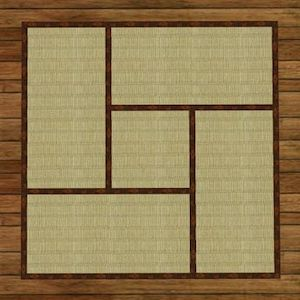

# Tatami LEMP

This is a simple Docker setup for legacy fullstack web development environment. I needed something light and basic to run old php scripts and legacy Laravel 7 projects. **Note: this is meant just for development purpose.**

Available software:
- NGINX
- MariaDB
- PHP 8
- PHP-FPM
- Composer
- PhpMyAdmin

## Setup
Download and install Docker desktop from [here](https://docs.docker.com/get-docker/).

Duplicate and rename `.env.example` as `.env` and change environment variables as needed.

Put all you project files into `/app` folder.

## Development
Start all services with Docker Compose:

```
// Start all services
docker-compose up

// use build flag if you need to rebuild images
docker-compose build --no-cache
```

> Note: first time you launch services, images will be built; process may be slow.

Your project can be reached at  `http://localhost:8080/ `

PhpMyAdmin will be available at  `http://localhost:8081/ `


## Stop all services
```
docker-compose down
```


## Bash
You can use `docker-compose exec` to get an interactive prompt and access app container.
This is very useful to run Composer commands.
When all services are up:

```
docker-compose exec app bash
```
